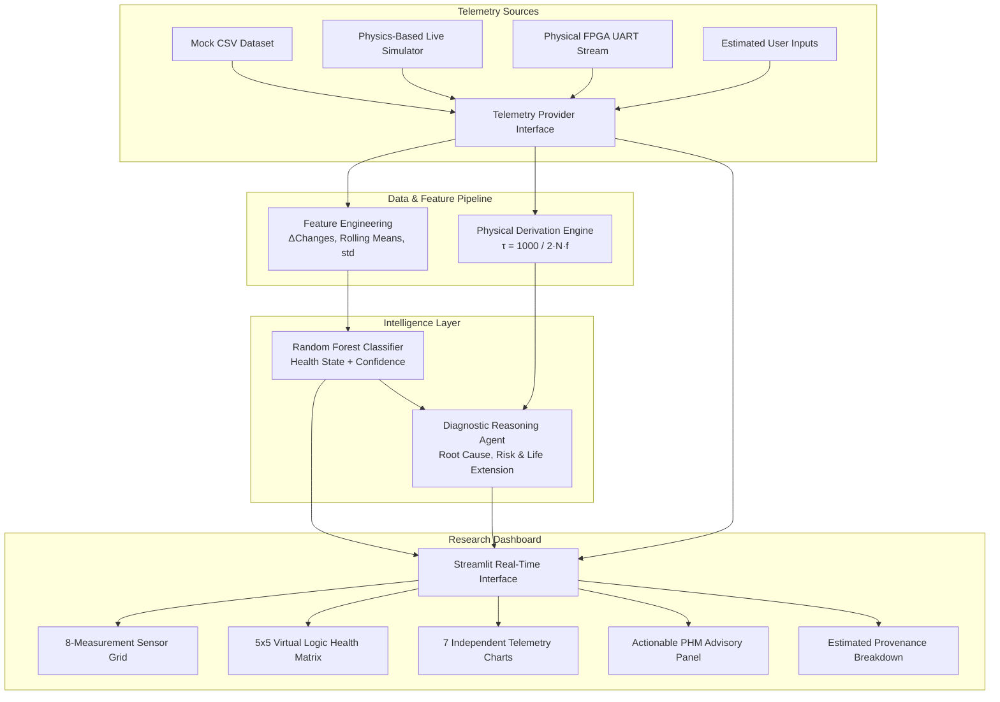

# AI-Assisted FPGA Health Monitoring & Predictive Health Management (PHM)

[](https://streamlit.io/)
[](https://scikit-learn.org/)
[](https://langchain-ai.github.io/langgraph/)
[](https://digilent.com/reference/programmable-logic/basys-3/start)

A research-grade health monitoring and predictive maintenance system for FPGAs (specifically modeled for Xilinx Artix-7 on Digilent Basys 3). The system tracks on-chip physical degradation mechanisms (e.g., Bias Temperature Instability, Hot Carrier Injection, thermal wear-out) by monitoring Ring Oscillator (RO) timing drift, die temperature, multi-rail supply voltages, and functional error rates.

---

## 🏗️ System Architecture



---

## 📋 Prerequisites

- **Python**: `3.10` or higher (tested up to `3.14`)
- **Virtual Environment Tool**: `venv` or `conda`
- **Optional Physical Hardware**: Digilent Basys 3 FPGA Board with micro-USB cable for UART streaming

---

## 🚀 Quick Start Guide

### 1. Clone & Set Up Virtual Environment

```powershell
# Clone the repository
git clone https://github.com/midhun474/FPGA.git
cd FPGA

# Create a virtual environment
python -m venv venv

# Activate the virtual environment
# On Windows (PowerShell):
.\venv\Scripts\Activate.ps1
# On Windows (CMD):
.\venv\Scripts\activate.bat
# On Linux / macOS:
source venv/bin/activate

# Install required dependencies
pip install -r requirements.txt
```

---

### 2. (Optional) Generate Dataset & Train ML Model

The repository includes a pre-generated dataset and trained model in `ml/models/fpga_health_model.pkl`. If you wish to regenerate the dataset and retrain from scratch:

```powershell
# 1. Generate 10,000 synthetic degradation telemetry samples
python mock/mock_fpga.py

# 2. Retrain the Random Forest model
python -m ml.train_model
```

---

### 3. Launch the Streamlit Dashboard

Run the Streamlit application using the command below:

```powershell
# Launch the dashboard
streamlit run dashboard/app.py
```

*If running directly from the virtual environment path:*
```powershell
.\venv\Scripts\streamlit.exe run dashboard/app.py
```

The application will launch in your default web browser at:
👉 **`http://localhost:8501`**

---

## 🎛️ Operating Modes in Dashboard

In the left sidebar under **Select Telemetry Source**, select from four operating modes:

| Mode | Description | Primary Use Case |
| :--- | :--- | :--- |
| **Mock Dataset (CSV)** | Replays sequential historical degradation data with step-by-step slider navigation. | Offline analysis, model validation, and demonstration. |
| **Live Simulation** | Generates real-time synthetic physics telemetry with continuous time-series streaming. | Dynamic multi-parameter response simulation without hardware. |
| **Physical UART Stream** | Connects directly to the physical FPGA board over a USB-to-UART serial COM port (115200 baud). | Production monitoring on physical hardware (e.g., Digilent Basys 3). |
| **Estimated Health Assessment** | Allows operators to manually input 1 to 6 available telemetry parameters. Unsupplied channels are imputed with verified nominal baselines. | Offline diagnostic estimations and partial telemetry analysis without active board connection. |

### 🔍 Estimated Health Assessment Methodology
- **Provenance Tracking**: Distinguishes **User-Provided** values, **Physically Derived** metrics ($\tau = 100 / f_{\text{MHz}}$), and **Assumed Nominal Baselines**.
- **Missing Value Handling**: Unsupplied channels default to verified Artix-7 nominal baselines ($T = 35.0^\circ\text{C}$, $\text{VCCINT} = 1.0\text{V}$, $\text{VCCAUX} = 1.8\text{V}$, $\text{VCCBRAM} = 1.0\text{V}$, $f_{\text{RO}} = 436.0\text{MHz}$, $\text{Error} = 0.00001$).
- **Input Completeness & Reliability**: Reports input completeness ($k / 6$) and diagnostic coverage weight separately from the ML softmax classification probability.
- **Estimated Health Stress Index**: Provides a continuous multi-domain operational risk score ($0.0$ to $1.0$) distinct from physical silicon lifetime consumption.

---

## 🛡️ Engineering Operating Limits & Safety Architecture

The system incorporates a **Deterministic Safety Envelope** that guarantees machine learning predictions never violate physical hardware boundaries or operating limits:

### Three-Tier Validation Architecture

```
                                  TELEMETRY INPUT
                                         │
                 ┌───────────────────────▼───────────────────────┐
                 │ 1. INPUT VALIDITY (Syntax & Type Checking)    │
                 │    - Checks numeric parsability (e.g. "abc")  │
                 └───────────────────────┬───────────────────────┘
                                         │ Valid
                 ┌───────────────────────▼───────────────────────┐
                 │ 2. PHYSICAL VALIDITY (Sensor Bound Plausibility)
                 │    - Validates hardware limits (-40°C to 125°C)│
                 └───────────────────────┬───────────────────────┘
                                         │ Plausible
                 ┌───────────────────────▼───────────────────────┐
                 │ 3. OPERATING HEALTH RANGE & HARD LIMITS       │
                 │    - Evaluates safe operating envelope        │
                 └───────────────────────┬───────────────────────┘
                                         │
                    ┌────────────────────┴────────────────────┐
                    ▼                                         ▼
   ┌─────────────────────────────────┐       ┌─────────────────────────────────┐
   │    Machine Learning Model       │       │    Engineering Limit Engine     │
   │  - Random Forest Classification │       │  - Deterministic Safety Rules   │
   │  - Softmax Probability Output   │       │  - Xilinx DS181 Operating Range │
   └────────────────┬────────────────┘       └────────────────┬────────────────┘
                    │                                         │
                    └────────────────────┬────────────────────┘
                                         │
                 ┌───────────────────────▼───────────────────────┐
                 │  DETERMINISTIC HEALTH RESOLUTION ENGINE       │
                 │  - Precedence: Engineering Limit > ML Output  │
                 │  - Displays dual ML + Final Health state      │
                 └───────────────────────┬───────────────────────┘
                                         ▼
                            LANGGRAPH DIAGNOSTIC AGENT
                                         ▼
                            STREAMLIT RESEARCH DASHBOARD
```

### Centralized Sensor Bounds & Engineering Limits

| Sensor Channel | Unit | Nominal | Physical Bounds | Operating Health Range | Hard Safety Limit | Primary Specification Source |
| :--- | :--- | :--- | :--- | :--- | :--- | :--- |
| **Temperature** | °C | 35.0 | $[-40.0, 125.0]$ | $[20.0, 45.0]$ | $\le 0.0$ (Freeze) or $\ge 52.0$ | Xilinx DS181 & Thermal Aging Model |
| **VCCINT** | V | 1.000 | $[0.000, 2.000]$ | $[0.950, 1.050]$ | $< 0.920$ or $> 1.080$ | Xilinx DS181 Recommended Operating (1.0V $\pm 5\%$) |
| **VCCAUX** | V | 1.800 | $[0.000, 3.000]$ | $[1.710, 1.890]$ | $< 1.650$ or $> 1.950$ | Xilinx DS181 Recommended Operating (1.8V $\pm 5\%$) |
| **VCCBRAM** | V | 1.000 | $[0.000, 2.000]$ | $[0.950, 1.050]$ | $< 0.920$ or $> 1.080$ | Xilinx DS181 Recommended Operating (1.0V $\pm 5\%$) |
| **RO Frequency** | MHz | 436.0 | $[10.0, 800.0]$ | $[427.0, 445.0]$ | $< 412.0$ (Severe Aging) or $> 460.0$ | Basys 3 Physical Measurement & 28nm Artix-7 Model |
| **Derived RO Delay** | ns | 0.2294 | $[0.050, 2.500]$ | $[0.2247, 0.2342]$ | $> 0.2427$ or $< 0.2174$ | Deterministic Physical Formula ($\tau = 100 / f$) |
| **Error Rate** | — | 0.000010 | $[0.0, 1.0]$ | $[0.0, 0.000500]$ | $> 0.002000$ (Functional fault) | Hardware PRBS-7 Monitor Engineering Assumption |

### Dual Health Display & Transparency
When an operating limit is breached (e.g., $T = 0.0^\circ\text{C}$ or $\text{VCCINT} = 0.2\text{V}$), the dashboard renders:
1. **Raw ML Output**: Shows original Random Forest class and confidence (e.g. `Healthy (92%)`).
2. **Final Engineering Assessment**: Highlights the hard limit override (e.g. `DEGRADED / CRITICAL — HARD OPERATING LIMIT OVERRIDE`).
3. **Root Cause Explanation**: Clear physical rationale for why the engineering limit took precedence.

---

## 🔬 Core Physics & Metrics

### Ring Oscillator Propagation Delay Formula

Ring Oscillator frequency drops as logic transistors age due to BTI/HCI threshold shifts. The physical propagation delay per logic stage $\tau$ is calculated as:

$$\tau = \frac{1000}{2 \cdot N \cdot f_{\text{MHz}}} = \frac{100}{f_{\text{MHz}}} \quad \text{[ns / stage]} \quad (N = 5\text{ stages})$$

- **$436.0\text{ MHz}$** $\implies \tau = 0.2294\text{ ns/stage}$ ($229.4\text{ ps}$, Nominal physical baseline)
- **$424.0\text{ MHz}$** $\implies \tau = 0.2358\text{ ns/stage}$ ($235.8\text{ ps}$, Moderate drift / Warning)
- **$410.0\text{ MHz}$** $\implies \tau = 0.2439\text{ ns/stage}$ ($243.9\text{ ps}$, Degraded state)

---

## 🧪 Verification & Health Checks

You can run automated verification tests across all data sources, hardware communication, and ML components:

```powershell
# Run Complete Test Suite (38 tests across Limits, Estimated Health, and UART Hardware)
python -m unittest discover tests

# Run Engineering Operating Limits Test Suite (14 tests)
python -m unittest tests/test_engineering_limits.py

# Run UART Hardware Interface Test Suite (11 tests)
python -m unittest tests/test_uart_hardware.py

# Run Estimated Health Assessment Test Suite (13 tests)
python -m unittest tests/test_estimated_health.py

# Test ML Prediction Engine
python -m ml.predict

# Test Diagnostic & Advisory Agent
python -m agent.langgraph_agent

# Test UART Receiver & Port Detection
python communication/uart_receiver.py
```

---

## 📂 Project Structure

```text
FPGA/
├── agent/
│   └── langgraph_agent.py      # Diagnostic reasoning & life-extension advisory agent
├── communication/
│   └── uart_receiver.py        # Serial/UART telemetry communication receiver (state machine)
├── config.py                   # Global hardware & physical constants (RO_STAGES, formulas)
├── dashboard/
│   ├── app.py                  # Main Streamlit dashboard application
│   ├── charts.py               # Altair telemetry trend charts (independent axes)
│   ├── components.py           # HTML/CSS KPI cards, baseline tables, advisory cards
│   ├── config.py               # Dashboard sensor bounds, baselines & threshold rules
│   ├── data_source.py          # Unified data source abstraction (CSV, Sim, UART, Estimated)
│   ├── health_map.py           # 5x5 Virtual Logic Health Matrix generator
│   └── styles.py               # Laboratory dark-theme embedded CSS
├── data/
│   └── raw/
│       └── mock_fpga_data.csv  # 10,000-sample synthetic degradation dataset
├── hardware/
│   ├── constraints/
│   │   └── basys3.xdc          # Master XDC pinouts & timing constraints for Basys 3
│   ├── rtl/
│   │   ├── error_rate_monitor.v    # PRBS-7 functional error rate monitor
│   │   ├── fpga_health_top.v       # Top-level interconnect & on-board LED diagnostics
│   │   ├── frequency_counter.v     # 10ms gated CDC frequency counter
│   │   ├── packet_formatter.v      # ASCII JSON & handshake serializer
│   │   ├── ring_oscillator.v       # 5-stage RO aging sensor (DONT_TOUCH protected)
│   │   ├── uart_tx.v               # 115200 baud UART serializer at 100MHz clock
│   │   └── xadc_sensor_reader.v    # 7-Series XADC DRP 4-channel sequencer
│   ├── vivado/
│   │   ├── build_bitstream.tcl     # Batch synthesis & implementation build script
│   │   └── program_fpga.tcl        # Hardware Manager programming script
│   └── README.md                   # Full hardware build, synthesis & setup guide
├── ml/
│   ├── feature_engineering.py  # Rolling stats & differential feature extraction
│   ├── models/
│   │   └── fpga_health_model.pkl # Trained Random Forest model (200 trees)
│   ├── predict.py              # ML inference pipeline wrapper
│   └── train_model.py          # ML training and evaluation script
├── mock/
│   └── mock_fpga.py            # Offline synthetic degradation dataset generator
├── tests/
│   ├── test_engineering_limits.py # Engineering operating limits & override tests (14 tests)
│   ├── test_estimated_health.py    # Estimated Health unit & integration tests (13 tests)
│   └── test_uart_hardware.py       # Physical UART hardware interface tests (11 tests)
├── requirements.txt            # Python dependencies
├── startup.md                  # System startup & execution guide (this file)
└── .gitignore                  # Git ignore rules for clean repository state
```

---

## 🛠️ Hardware UART Packet Specification

When streaming from a physical FPGA over UART at **115200 Baud, 8N1**, packets can be transmitted in either JSON or comma-separated key-value formats:

**JSON Format (Recommended):**
```json
{"Temperature": 42.5, "VCCINT": 0.998, "VCCAUX": 1.795, "VCCBRAM": 0.998, "RO_Frequency": 245.2, "Error_Rate": 0.0001}
```

**Key-Value Format:**
```text
TEMP:42.5,VCCINT:0.998,VCCAUX:1.795,VCCBRAM:0.998,RO_FREQ:245.2,ERR:0.0001
```

---

## 📜 Research & Academic Disclaimer

This project is an AI-assisted diagnostic prototype for academic and experimental research. Predictions and life-extension suggestions represent statistical model outputs and analytical estimations rather than hardware warranties.
