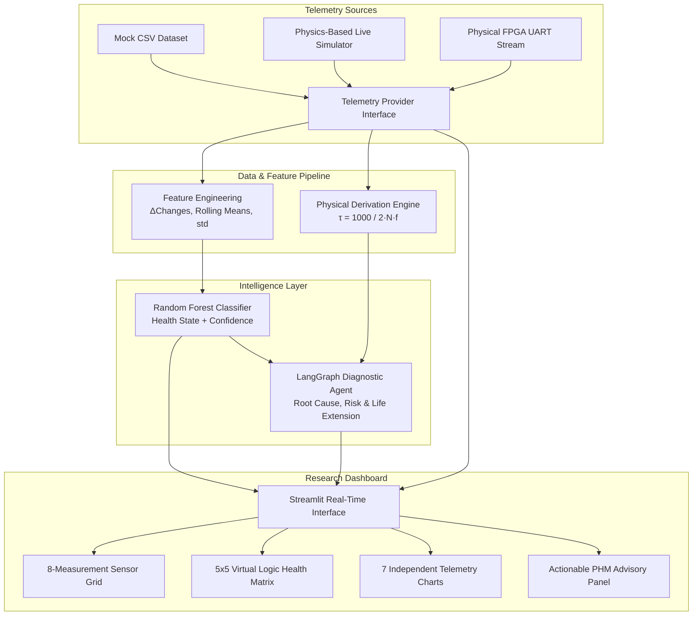

# AI-Assisted FPGA Health Monitoring & Predictive Health Management (PHM)

[](https://streamlit.io/)
[](https://scikit-learn.org/)
[](https://langchain-ai.github.io/langgraph/)
[](https://digilent.com/reference/programmable-logic/basys-3/start)

A research-grade health monitoring and predictive maintenance system for FPGAs (specifically modeled for Xilinx Artix-7 on Digilent Basys 3). The system tracks on-chip physical degradation mechanisms (e.g., Bias Temperature Instability, Hot Carrier Injection, thermal wear-out) by monitoring Ring Oscillator (RO) timing drift, die temperature, multi-rail supply voltages, and functional error rates.

---

## 🏗️ System Architecture



---

## 📋 Prerequisites

- **Python**: `3.10` or higher (tested up to `3.14`)
- **Virtual Environment Tool**: `venv` or `conda`
- **Optional Physical Hardware**: Digilent Basys 3 FPGA Board with micro-USB cable for UART streaming

---

## 🚀 Quick Start Guide

### 1. Clone & Set Up Virtual Environment

```powershell
# Clone the repository
git clone https://github.com/midhun474/FPGA.git
cd FPGA

# Create a virtual environment
python -m venv venv

# Activate the virtual environment
# On Windows (PowerShell):
.\venv\Scripts\Activate.ps1
# On Windows (CMD):
.\venv\Scripts\activate.bat
# On Linux / macOS:
source venv/bin/activate

# Install required dependencies
pip install -r requirements.txt
```

---

### 2. (Optional) Generate Dataset & Train ML Model

The repository includes a pre-generated dataset and trained model in `ml/models/fpga_health_model.pkl`. If you wish to regenerate the dataset and retrain from scratch:

```powershell
# 1. Generate 10,000 synthetic degradation telemetry samples
python mock/mock_fpga.py

# 2. Retrain the Random Forest model
python -m ml.train_model
```

---

### 3. Launch the Streamlit Dashboard

Run the Streamlit application using the command below:

```powershell
# Launch the dashboard
streamlit run dashboard/app.py
```

*If running directly from the virtual environment path:*
```powershell
.\venv\Scripts\streamlit.exe run dashboard/app.py
```

The application will launch in your default web browser at:
👉 **`http://localhost:8501`**

---

## 🎛️ Operating Modes in Dashboard

In the left sidebar under **Data Stream Source**, select from three operating modes:

| Mode | Description | Primary Use Case |
| :--- | :--- | :--- |
| **Mock Dataset (CSV)** | Replays sequential historical degradation data with step-by-step slider navigation. | Offline analysis, model validation, and demonstration. |
| **Live Simulation** | Generates real-time synthetic physics telemetry with continuous time-series streaming. | UI testing and dynamic multi-parameter response simulation without hardware. |
| **Live Hardware (UART)** | Connects directly to the physical FPGA board over a USB-to-UART serial COM port (115200 baud). | Production monitoring on physical hardware (e.g., Digilent Basys 3). |

---

## 🔬 Core Physics & Metrics

### Ring Oscillator Propagation Delay Formula

Ring Oscillator frequency drops as logic transistors age due to BTI/HCI threshold shifts. The physical propagation delay per logic stage $\tau$ is calculated as:

$$\tau = \frac{1000}{2 \cdot N \cdot f_{\text{MHz}}} \quad \text{[ns / stage]}$$

Where:
- $N = 5$ (Number of internal inverter stages in the ring)
- $f_{\text{MHz}}$ = Ring Oscillator oscillating frequency in $\text{MHz}$
- **Nominal Reference**: $250.0\text{ MHz} \implies \tau = 0.4000\text{ ns/stage}$

---

## 🧪 Verification & Health Checks

You can run individual verification tests on the core modules:

```powershell
# Test ML Prediction Engine
python -m ml.predict

# Test LangGraph Diagnostic & Advisory Agent
python -m agent.langgraph_agent

# Test UART Receiver & Port Detection
python communication/uart_receiver.py
```

---

## 📂 Project Structure

```text
FPGA/
├── agent/
│   └── langgraph_agent.py      # LangGraph diagnostic & life-extension agent
├── communication/
│   └── uart_receiver.py        # Serial/UART telemetry communication receiver
├── config.py                   # Global hardware & physical constants (RO_STAGES, formulas)
├── dashboard/
│   ├── app.py                  # Main Streamlit dashboard application
│   ├── charts.py               # Altair telemetry trend charts (independent axes)
│   ├── components.py           # HTML/CSS KPI cards, baseline tables, advisory cards
│   ├── config.py               # Dashboard sensor bounds, baselines & threshold rules
│   ├── data_source.py          # Unified data source abstraction (CSV, Sim, UART)
│   ├── health_map.py           # 5x5 Virtual Logic Health Matrix generator
│   └── styles.py               # Laboratory dark-theme embedded CSS
├── data/
│   └── raw/
│       └── mock_fpga_data.csv  # 10,000-sample synthetic degradation dataset
├── ml/
│   ├── feature_engineering.py  # Rolling stats & differential feature extraction
│   ├── models/
│   │   └── fpga_health_model.pkl # Trained Random Forest model (200 trees)
│   ├── predict.py              # ML inference pipeline wrapper
│   └── train_model.py          # ML training and evaluation script
├── mock/
│   └── mock_fpga.py            # Offline synthetic degradation dataset generator
├── requirements.txt            # Python dependencies
├── startup.md                  # System startup & execution guide (this file)
└── .gitignore                  # Git ignore rules for clean repository state
```

---

## 🛠️ Hardware UART Packet Specification

When streaming from a physical FPGA over UART at **115200 Baud, 8N1**, packets can be transmitted in either JSON or comma-separated key-value formats:

**JSON Format (Recommended):**
```json
{"Temperature": 42.5, "VCCINT": 0.998, "VCCAUX": 1.795, "VCCBRAM": 0.998, "RO_Frequency": 245.2, "Error_Rate": 0.0001}
```

**Key-Value Format:**
```text
TEMP:42.5,VCCINT:0.998,VCCAUX:1.795,VCCBRAM:0.998,RO_FREQ:245.2,ERR:0.0001
```

---

## 📜 Research & Academic Disclaimer

This project is an AI-assisted diagnostic prototype for academic and experimental research. Predictions and life-extension suggestions represent statistical model outputs and analytical estimations rather than hardware warranties.
