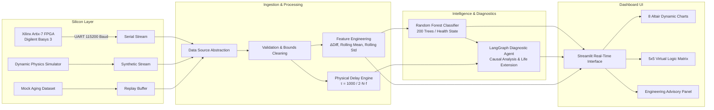
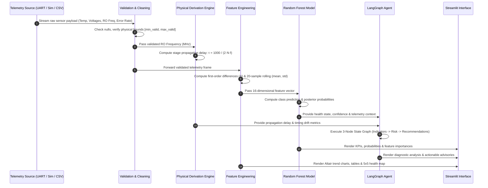

# Comprehensive Technical Summary: AI-Assisted FPGA Health Monitoring & Predictive Health Management (PHM)

---

## 1. Executive Overview

The **AI-Assisted FPGA Health Monitoring & Predictive Health Management (PHM)** system is an end-to-end hardware-software telemetry, diagnostics, and machine learning framework designed for real-time silicon reliability assessment. Specifically modeled for the **Xilinx Artix-7 (XC7A35T-1CPG236C)** FPGA on the **Digilent Basys 3** platform (28nm High-K Metal Gate CMOS architecture), the platform detects, quantifies, and predicts progressive on-chip silicon degradation.

The system tracks physical wear-out mechanisms—including **Bias Temperature Instability (BTI)**, **Hot Carrier Injection (HCI)**, **Time-Dependent Dielectric Breakdown (TDDB)**, **Electromigration (EM)**, and **Thermal Stress**—by monitoring on-chip Ring Oscillator (RO) timing drift, XADC die temperature, multi-rail supply voltages, and functional error rates.



---

## 2. Python Libraries Used and Their Technical Roles

The project utilizes a focused, robust Python technology stack:

| Library | Version / Scope | Primary Technical Role in Project |
| :--- | :--- | :--- |
| **`numpy`** | Numerical Engine | Vectorized mathematical operations, Gaussian noise generation for synthetic physical sensor simulation ($\mathcal{N}(\mu, \sigma^2)$), statistical boundary calculations. |
| **`pandas`** | Data Wrangling | Telemetry tabular structures (`DataFrame`, `Series`), forward/backward fill interpolation, discrete first-order differencing (`.diff()`), and rolling window statistics (`.rolling()`). |
| **`scikit-learn`** | Machine Learning Pipeline | `RandomForestClassifier` ensemble modeling, `train_test_split` with stratification, evaluation metrics (`accuracy_score`, `precision_score`, `recall_score`, `f1_score`, `confusion_matrix`, `classification_report`). |
| **`joblib`** | Model Persistence | Binary serialization and deserialization of the trained Random Forest model bundle, feature schema, class labels, and hardware constants into `ml/models/fpga_health_model.pkl`. |
| **`streamlit`** | Real-Time Dashboard | Reactive web application, component layout management, custom CSS injection (`st.html`), cached model loaders (`@st.cache_resource`), session state management, and real-time polling loops. |
| **`altair`** | Telemetry Visualization | Declarative statistical charting engine powering 8 dedicated, independent dark-themed time-series plots with custom axes, reference rules, gradients, and interactive tooltips. |
| **`pyserial`** | Hardware Interfacing | Low-level USB-to-UART serial interface (`serial.Serial`, `serial.tools.list_ports`) for hardware-in-the-loop telemetry streaming from the Basys 3 board at 115200 baud. |
| **`pathlib` / `sys` / `os`** | System & Environment | Cross-platform file path resolution, workspace root discovery, dynamic directory creation, and module import resolution. |
| **`typing`** | Static Typing | Structured type annotations (`TypedDict`, `Optional`, `Dict`, `List`, `Tuple`, `Any`) enforcing strict state schemas across the diagnostic pipeline and UI modules. |
| **`json`** | Telemetry Deserialization | Fast decoding and sanitization of incoming JSON-formatted hardware UART packets from the FPGA. |
| **`time`** | Clocking & Synchronization | Epoch timestamp generation, telemetry synchronization, and dashboard auto-polling delays. |
| **`textwrap`** | UI Code Generation | Clean multi-line indentation stripping for embedded SVG graphics, HTML cards, and custom CSS styling. |

---

## 3. Mathematical Expressions & Physical Formulations

### 3.1 Ring Oscillator (RO) Physical Propagation Delay

A Ring Oscillator consists of an odd number $N$ of inverting logic gates connected in a closed ring. The total oscillation period $T$ corresponds to the time required for a transition to traverse the ring twice (once high-to-low, once low-to-high):

$$T = 2 \cdot N \cdot \tau$$

Where:
- $T$ = Period of oscillation in seconds ($T = \frac{1}{f_{\text{Hz}}}$)
- $N$ = Number of inverter stages ($N = 5$ on the target Artix-7 design)
- $\tau$ = Average propagation delay per inverter stage in seconds ($\text{s}$)
- $f_{\text{Hz}}$ = Oscillating frequency in Hertz ($\text{Hz}$)

Converting frequency to Megahertz ($f_{\text{MHz}} = f_{\text{Hz}} \times 10^{-6}$) and delay to nanoseconds ($\tau_{\text{ns}} = \tau \times 10^{9}$):

$$\tau_{\text{seconds}} = \frac{1}{2 \cdot N \cdot (f_{\text{MHz}} \cdot 10^6)}$$

$$\tau_{\text{ns}} = \tau_{\text{seconds}} \cdot 10^9 = \frac{10^9}{2 \cdot N \cdot f_{\text{MHz}} \cdot 10^6} = \frac{1000}{2 \cdot N \cdot f_{\text{MHz}}}$$

For the $N = 5$ inverter stage architecture:

$$\tau_{\text{ns}} = \frac{1000}{2 \cdot 5 \cdot f_{\text{MHz}}} = \frac{100}{f_{\text{MHz}}} \quad \text{[ns / stage]}$$

#### Physical Benchmarks on 28nm HKMG Artix-7:
- **Nominal Healthy State** ($f = 250.0\text{ MHz}$):
  $$\tau_{\text{nominal}} = \frac{100}{250.0} = 0.4000\text{ ns / stage} \quad (400\text{ ps})$$
- **Aged / Degraded State** ($f = 235.0\text{ MHz}$):
  $$\tau_{\text{degraded}} = \frac{100}{235.0} \approx 0.4255\text{ ns / stage} \quad (425.5\text{ ps})$$
- **Physical Feasibility Bounds**: $0.10\text{ ns} \le \tau_{\text{ns}} \le 2.50\text{ ns}$ (values outside this range trigger a critical hardware validation error).

---

### 3.2 Relative Drift & Baseline Percentage Shift

Drift metrics quantify physical deviation from initial healthy baseline calibration values:

$$\Delta f_{\text{RO, \%}} = \left( \frac{f_{\text{current}} - f_{\text{baseline}}}{f_{\text{baseline}}} \right) \times 100\%$$

$$\Delta \tau_{\text{RO, \%}} = \left( \frac{\tau_{\text{current}} - \tau_{\text{baseline}}}{\tau_{\text{baseline}}} \right) \times 100\%$$

$$\Delta T = T_{\text{current}} - T_{\text{baseline}} \quad \text{[°C]}$$

$$\Delta V_{\text{rail}} = V_{\text{rail, current}} - V_{\text{rail, baseline}} \quad \text{[V]}$$

---

### 3.3 Feature Engineering Formulations

To capture temporal trends and dynamic volatility, the feature extractor transforms raw sensor channels over sliding windows:

1. **First-Order Discrete Difference (Step-to-Step Rate of Change)**:
   $$\Delta X[t] = X[t] - X[t-1] \quad (\text{with } \Delta X[0] = 0)$$

2. **Rolling Window Mean ($w = 20$ samples)**:
   $$\mu_X[t] = \frac{1}{w} \sum_{k=0}^{w-1} X[t-k]$$

3. **Rolling Window Standard Deviation (Short-Term Volatility / Noise)**:
   $$\sigma_X[t] = \sqrt{\frac{1}{w-1} \sum_{k=0}^{w-1} \left( X[t-k] - \mu_X[t] \right)^2}$$

---

### 3.4 Composite Aggregate Risk Score Formulation (Virtual Logic Matrix)

The $5 \times 5$ Virtual Logic Health Matrix derives a normalized continuous composite risk index $\mathcal{R}_{\text{composite}} \in [0.0, 1.0]$:

$$\mathcal{R}_{\text{composite}} = \text{clip}\left( 0.45 \cdot S_{\text{health}} + 0.20 \cdot F_{\text{temp}} + 0.20 \cdot F_{\text{RO}} + 0.15 \cdot F_{\text{err}}, \, 0.0, \, 1.0 \right)$$

Where:
- **Base ML Health Severity Score** ($S_{\text{health}}$):
  $$S_{\text{health}} = \begin{cases} 0.15 & \text{if Predicted Health is Healthy} \\ 0.50 & \text{if Predicted Health is Warning} \\ 0.85 & \text{if Predicted Health is Degraded} \\ 0.95 & \text{if Critical Boundary Exceeded} \end{cases}$$
- **Thermal Stress Factor** ($F_{\text{temp}}$):
  $$F_{\text{temp}} = \text{clip}\left( \frac{T - 35.0}{20.0}, \, 0.0, \, 1.0 \right)$$
- **Ring Oscillator Degradation Factor** ($F_{\text{RO}}$):
  $$F_{\text{RO}} = \text{clip}\left( \frac{|\min(0, \Delta f_{\text{RO, \%}})|}{6.5}, \, 0.0, \, 1.0 \right)$$
- **Error Rate Factor** ($F_{\text{err}}$):
  $$F_{\text{err}} = \text{clip}\left( \frac{\text{Error\_Rate}}{0.003}, \, 0.0, \, 1.0 \right)$$

#### Spatial Diffusion Across the 25 Virtual CLB Tiles:
Each cell $i \in \{1, \dots, 25\}$ in the $5 \times 5$ grid applies a spatial weight $W_i \in [0.70, 1.00]$ modeling degradation concentration at the center logic fabric:

$$\mathcal{R}_{\text{cell}, i} = \mathcal{R}_{\text{composite}} \cdot W_i$$

$$\text{State}_i = \begin{cases} \text{Healthy (Green)} & \text{if } \mathcal{R}_{\text{cell}, i} < 0.32 \\ \text{Warning (Yellow)} & \text{if } 0.32 \le \mathcal{R}_{\text{cell}, i} < 0.62 \\ \text{Degraded (Orange)} & \text{if } 0.62 \le \mathcal{R}_{\text{cell}, i} < 0.84 \\ \text{Critical (Red)} & \text{if } \mathcal{R}_{\text{cell}, i} \ge 0.84 \end{cases}$$

---

### 3.5 Physics-Based Synthetic Telemetry Generation Model

The simulation engine models accelerated aging degradation over a continuous lifecycle factor $d \in [0.0, 1.0]$:

$$\text{Temperature}(d) = 35.0 + 18.0 \cdot d + \mathcal{N}(0, 0.8^2) \quad \text{[°C]}$$

$$V_{\text{CCINT}}(d) = 1.000 - 0.010 \cdot d + \mathcal{N}(0, 0.001^2) \quad \text{[V]}$$

$$V_{\text{CCAUX}}(d) = 1.800 - 0.010 \cdot d + \mathcal{N}(0, 0.001^2) \quad \text{[V]}$$

$$V_{\text{CCBRAM}}(d) = 1.000 - 0.008 \cdot d + \mathcal{N}(0, 0.001^2) \quad \text{[V]}$$

$$f_{\text{RO}}(d) = 250.0 - 15.0 \cdot d + \mathcal{N}(0, 0.8^2) \quad \text{[MHz]}$$

$$P_{\text{error}}(d) = \max\left( 0.0, \, 0.00001 + 0.003 \cdot d + \mathcal{N}(0, 0.0002^2) \right)$$

---

## 4. User Interface Architecture & Component Specifications

The user interface is built using Streamlit with a custom embedded dark theme (`dashboard/styles.py`) adhering to an industrial laboratory aesthetic.

```
+---------------------------------------------------------------------------------------------------+
|  [HEADER BANNER]  Inline SVG Artix-7 Chip  |  Status: ACTIVE  |  Source Badge  |  Target Hardware |
+---------------------------------------------------------------------------------------------------+
|  [SECTION 1: PRIMARY KPIS]                                                                        |
|  [ FPGA Health State ]  [ ML Confidence % ]  [ Die Temperature °C ]  [ Operational Error Risk ]   |
+---------------------------------------------------------------------------------------------------+
|  [SECTION 2: MEASUREMENTS GRID (8 CARDS)]                                                         |
|  [ Die Temp (Δ) ]  [ VCCINT (Δ) ]     [ VCCAUX (Δ) ]      [ VCCBRAM (Δ) ]                         |
|  [ RO Freq (Δ) ]   [ RO Delay (Δ) ]   [ Error Rate (Δ) ]  [ Sample Cycle # ]                      |
+---------------------------------------------------------------------------------------------------+
|  [SECTION 3: RING OSCILLATOR AGING INDICATOR]                                                     |
|  [ RO Freq Shift % ]          [ RO Delay Shift % ]          [ Timing Degradation Status ]         |
+---------------------------------------------------------------------------------------------------+
|  [SECTION 4: MULTI-TAB TELEMETRY TREND CHARTS (5 TABS / 8 INDEPENDENT CHARTS)]                    |
|  [Tab 1: RO Freq & Delay]  [Tab 2: Temp]  [Tab 3: Voltages]  [Tab 4: Error Rate]  [Tab 5: Trends] |
+---------------------------------------------------------------------------------------------------+
|  [SECTION 5: BASELINE COMPARISON TABLE]                                                           |
|  Channel | Current Reading | Baseline Benchmark | Absolute / Relative Shift | Assessment          |
+---------------------------------------------------------------------------------------------------+
|  [SECTION 6: SENSOR STATUS EVALUATION TABLE]                                                      |
|  Sensor Channel | Current Reading | Nominal Rating | Operational Status | Temporal Trend          |
+---------------------------------------------------------------------------------------------------+
|  [SECTION 7: ML PREDICTION & FEATURE IMPORTANCE]                                                  |
|  [ Model Class Probabilities (Healthy/Warning/Degraded) ] | [ Top Feature Importance Bar Chart ]  |
+---------------------------------------------------------------------------------------------------+
|  [SECTION 8: FPGA HEALTH RISK MAP]                                                                |
|  [ 5x5 Virtual Logic Fabric Cluster (CLB-11 through CLB-55) with Composite Risk Index & Legend ]  |
+---------------------------------------------------------------------------------------------------+
|  [SECTION 9: LANGGRAPH AI DIAGNOSTIC RECOMMENDATIONS]                                             |
|  [ Risk Badge | Diagnostic Summary | Primary Indicators List | Targeted Engineering Actions ]     |
+---------------------------------------------------------------------------------------------------+
|  [SECTION 10: LIFETIME EXTENSION GUIDELINES (6 CATEGORIES)]                                       |
|  [ Thermal Mgt | Voltage Regulation | Workload Optimization | Timing | ECC RAM | Proactive Maint ]|
+---------------------------------------------------------------------------------------------------+
|  [SECTION 11: TELEMETRY BUFFER & ENGINEERED FEATURES EXPANDER]                                    |
|  [ Styled Tabular Historical Records | 16-Dimensional Transformed Feature Matrix ]                |
+---------------------------------------------------------------------------------------------------+
|  [SECTION 12: RESEARCH TRANSPARENCY & SYSTEM INFORMATION MODAL]                                   |
|  [ Architecture Diagram | Sensor Boundaries | Non-Self-Healing Research Disclaimer ]              |
+---------------------------------------------------------------------------------------------------+
```

### Detailed Breakdown of Interface Components & Uses

1. **Top Research Header & Inline SVG Chip**:
   - Displays animated pulsing status badges, active telemetry data source label, and target hardware platform string (`Xilinx Artix-7 XC7A35T-1CPG236C`).
   - Renders a zero-dependency vector SVG graphic illustrating the FPGA die, bonding wires, and logic array.

2. **Interactive Sidebar Control Panel**:
   - **Data Stream Selector**: Switches dynamically between *Mock Dataset (CSV Replay)*, *Dynamic Simulation Stream*, and *Physical UART Stream (Artix-7)*.
   - **Timeline Scrubber & Quick Presets**: Slider navigating 0 to 9,999 historical samples with one-click jump buttons (`🟢 Healthy` @ sample 1000, `🟡 Warning` @ sample 5000, `🟠 Degraded` @ sample 9200).
   - **Simulation Controls**: Slider to adjust degradation factor ($0.0$ to $1.0$) and manual step-injection buttons.
   - **Hardware UART Manager**: Port selection dropdown auto-populated via `pyserial`, with Connect and Disconnect handlers.
   - **Live Auto-Refresh Loop**: Toggle switch with polling intervals ($1\text{s}$, $2\text{s}$, $5\text{s}$, $10\text{s}$) for automatic real-time streaming.

3. **Current FPGA Health KPIs (Section 1)**:
   - 4 high-contrast cards displaying classified health state (`Healthy`, `Warning`, `Degraded`), Random Forest probability confidence percentage, die temperature, and operational risk category.

4. **8-Sensor Telemetry Grid (Section 2)**:
   - Real-time numerical readouts for Die Temperature, Core Voltage (VCCINT), Auxiliary Voltage (VCCAUX), Block RAM Voltage (VCCBRAM), RO Frequency, Derived Stage Delay, Functional Error Rate, and Telemetry Sequence Counter.
   - Every card includes dynamic color-coded delta indicators ($\Delta$) computed against the initial baseline calibration.

5. **Dedicated Ring Oscillator Timing Degradation Section (Section 3)**:
   - Specifically isolates gate slowing and propagation delay degradation with high-precision percentage shifts ($\Delta f_{\%}$, $\Delta \tau_{\%}$) and operational status indicators.

6. **Multi-Tab Telemetry Trend Charts (Section 4)**:
   - High-performance Altair visualizations organized across 5 distinct tabs to prevent scale conflation.

7. **Baseline Comparison & Sensor Status Tables (Sections 5 & 6)**:
   - Tabular drift analysis quantifying absolute and percentage shifts against baseline reference values.
   - Centralized threshold auditing evaluating values against manufacturer tolerances, annotated with temporal trend arrows ($\uparrow$ Increasing, $\downarrow$ Decreasing, $\rightarrow$ Stable).

8. **Machine Learning Health Prediction & Feature Importance (Section 7)**:
   - Visual progress bars showing exact posterior probability distributions across all classes (`Healthy`, `Warning`, `Degraded`).
   - Horizontal bar chart displaying the top features contributing to the model's classification decisions.

9. **FPGA Health Risk Map (Section 8)**:
   - A $5 \times 5$ interactive grid of 25 logic tiles (`CLB-11` to `CLB-55`) visually depicting spatial degradation diffusion, paired with a composite risk index and an explicit scientific disclaimer.

10. **LangGraph AI Agent Recommendations & Life Extension (Sections 9 & 10)**:
    - Structured natural language root-cause analysis generated by the agent state graph.
    - Actionable engineering advisories across Thermal, Timing, Voltage, Reliability, and Predictive Maintenance domains.

11. **Telemetry Records & Feature Expander (Section 11)**:
    - Historical data table showing formatted raw values alongside the complete 16-dimensional engineered feature matrix.

---

## 5. End-to-End Data Workflow

The telemetry data passes through a multi-stage deterministic pipeline:



### Detailed Pipeline Stages:

1. **Ingestion Stage**:
   - `LiveUARTDataSource`: Reads UART serial lines at 115200 baud, parsing JSON (`{"Temperature": 42.5, ...}`) or comma-separated key-value pairs (`TEMP:42.5,VCCINT:0.998,...`).
   - `LiveSimulationDataSource`: Step-generates physics-based synthetic measurements with degradation drift.
   - `MockCSVDataSource`: Replays pre-recorded 10,000-sample historical degradation datasets with indexed scrubber lookup.

2. **Validation & Sanitization Stage (`validate_and_clean_data`)**:
   - Checks for presence of all required channels.
   - Applies forward/backward fill interpolation for missing values.
   - Performs physical bounds clamping against allowable silicon operating limits.

3. **Physics Derivation Stage (`config.py`)**:
   - Calculates the exact per-stage inverter propagation delay ($\tau_{\text{ns}}$) from oscillator frequency and stage count ($N = 5$).
   - Validates that propagation delay falls within the physical bounds for 28nm silicon ($0.10 \text{ ns} \le \tau \le 2.50 \text{ ns}$).

4. **Feature Engineering Stage (`ml/feature_engineering.py`)**:
   - Generates differential step-change features (`Temperature_change`, `RO_Frequency_change`, `RO_Delay_change`, `Error_Rate_change`).
   - Computes rolling statistical metrics over a 20-sample window (`Temperature_mean`, `Temperature_std`, `RO_Frequency_mean`, `RO_Frequency_std`, `Error_Rate_mean`).

5. **Machine Learning Inference Stage (`ml/predict.py`)**:
   - Feeds the 16-dimensional feature vector into the trained Random Forest classifier.
   - Outputs discrete state classification (`Healthy`, `Warning`, `Degraded`) and maximum class confidence probability.

6. **Agentic Diagnostic Reasoning Stage (`agent/langgraph_agent.py`)**:
   - Translates numerical outputs and baseline shifts into engineering causal factors.
   - Evaluates multi-channel risk severity (`LOW`, `MODERATE`, `HIGH`, `CRITICAL`).
   - Formulates targeted preventative actions and life-extension guidance.

7. **Presentation & Visualization Stage (`dashboard/app.py`)**:
   - Dynamically updates KPI metrics, 8 dedicated Altair charts, baseline tables, and the $5 \times 5$ Virtual Logic Health Matrix.

---

## 6. Visualization & Charting Architecture

To preserve physical readability, disparate physical units are strictly separated into dedicated charts with independent scaling:

| Graph / Visualization | Visual Encoding | Color Palette | Key Reference Elements | Technical Purpose |
| :--- | :--- | :--- | :--- | :--- |
| **1. RO Frequency Trend** | Continuous Line | `#00E5FF` (Cyan) | Blue dashed horizontal rule at baseline ($250.0\text{ MHz}$) | Tracks transistor switching speed degradation over time. |
| **2. Derived RO Stage Delay Trend** | Continuous Line | `#D946EF` (Magenta) | Purple dashed rule at baseline ($0.4000\text{ ns}$) | Directly quantifies physical gate propagation delay increase ($\tau$). |
| **3. Die Temperature Trend** | Continuous Line | `#FF5252` (Coral Red) | Green dashed rule (baseline $35\text{°C}$), Orange dashed rule (warning threshold $50\text{°C}$) | Identifies thermal accumulation and acceleration of BTI wear-out. |
| **4. Functional Error Rate Trend** | Filled Area with Gradient | `#FFAB00` (Amber) | Linear vertical opacity gradient ($0.45 \to 0.02$) | Highlights onset of soft errors, timing violations, and memory upsets. |
| **5. Supply Voltage Rails (3 Sub-Charts)** | Continuous Lines | `#00E676` (Core), `#38BDF8` (Aux), `#A855F7` (BRAM) | White dashed rules at nominal voltages ($1.000\text{V}$, $1.800\text{V}$, $1.000\text{V}$) | Audits IR-drop, power delivery integrity, and voltage rail droop. |
| **6. Health Prediction Trend** | Categorical Circles | Green (0), Yellow (1), Orange (2) | Discrete Y-axis mapped to Healthy, Warning, Degraded | Visualizes state transition timeline across the silicon lifecycle. |
| **7. Normalized Health Indicators** | Multi-Line Composite | Multi-color lines | Normalized continuous scale ($0.0 = \text{Nominal}$, $1.0 = \text{Stressed}$) | Cross-correlates multi-sensor dynamics on a single dimensionless scale. |
| **8. Feature Importance Bar Chart** | Horizontal Bar Chart | `#00E5FF` (Cyan) | Sorted descending importance weights ($0.0 \to 1.0$) | Provides model explainability by ranking key diagnostic features. |
| **9. Virtual Logic Matrix ($5 \times 5$)** | 25 Spatial Heatmap Tiles | Green, Yellow, Orange, Red | Cell labels (`CLB-11` to `CLB-55`), Composite Risk Score | Visualizes synthetic spatial risk diffusion across the logic fabric. |

---

## 7. Backend Architecture & Modular Codebase

The backend is architected into modular, single-responsibility subsystems:

```text
FPGA/
├── config.py                   # Centralized hardware specifications, physical constants & delay formulas
├── requirements.txt            # Minimal, pinned Python package dependencies
├── startup.md                  # System startup instructions & execution guide
├── summary.md                  # Comprehensive architectural summary (this document)
│
├── agent/
│   └── langgraph_agent.py      # 3-Node LangGraph sequential diagnostic reasoning engine
│
├── communication/
│   └── uart_receiver.py        # Hardware serial communication & UART packet parser
│
├── data/
│   └── raw/
│       └── mock_fpga_data.csv  # 10,000-sample synthetic degradation telemetry dataset
│
├── ml/
│   ├── __init__.py             # Module initialization
│   ├── feature_engineering.py  # First-order differences & rolling window transformations
│   ├── train_model.py          # Training pipeline, stratified validation & audit
│   ├── predict.py              # Model inference wrapper
│   └── models/
│       └── fpga_health_model.pkl # Serialized Random Forest model bundle
│
├── mock/
│   └── mock_fpga.py            # Physics-based synthetic telemetry dataset generator
│
└── dashboard/
    ├── app.py                  # Main Streamlit dashboard application
    ├── charts.py               # Altair dark-themed chart specifications
    ├── components.py           # Custom HTML/CSS cards, tables & UI widgets
    ├── config.py               # Sensor boundaries, nominals & color schemes
    ├── data_source.py          # Unified data source abstraction layer
    ├── health_map.py           # 5x5 Virtual Logic Matrix generation logic
    └── styles.py               # Embedded CSS styles & standalone SVG chip graphic
```

### Module Descriptions:

- **`config.py`**:
  Central source of physical truth. Defines `DEVICE_NAME`, `ARCHITECTURE`, `RO_STAGES = 5`, and implements `calculate_ro_delay_ns()` and `validate_ro_delay()`.
- **`mock/mock_fpga.py`**:
  Generates 10,000 synthetic degradation samples combining linear drift, physical noise, and delay conversions, saving them to `data/raw/mock_fpga_data.csv`.
- **`communication/uart_receiver.py`**:
  Manages serial port discovery (`list_available_ports`), connection lifecycle, and dual-format UART packet decoding (JSON and key-value string) with physical bounds filtering.
- **`ml/feature_engineering.py`**:
  Transforms raw telemetry into a 16-dimensional feature vector containing step differences ($\Delta$) and 20-sample rolling statistics ($\mu, \sigma$).
- **`ml/train_model.py`**:
  Trains a 200-tree Random Forest classifier using an 80/20 stratified split, evaluates multi-class metrics, prints confusion matrices, and exports the serialized model bundle.
- **`agent/langgraph_agent.py`**:
  Implements a diagnostic pipeline through a 3-node state graph:
  1. `analyze_indicators`: Evaluates telemetry deviations and identifies primary physical stress signatures.
  2. `assess_risk`: Determines overall operational risk severity (`LOW`, `MODERATE`, `HIGH`, `CRITICAL`).
  3. `formulate_recommendations`: Synthesizes actionable preventative maintenance and life-extension strategies.
- **`dashboard/data_source.py`**:
  Provides a unified interface (`get_data()`) across `MockCSVDataSource`, `LiveSimulationDataSource`, and `LiveUARTDataSource`, ensuring seamless hot-swapping between replay, simulation, and live hardware modes.

---

## 8. Machine Learning Model: Algorithm Selection & Rationale

### 8.1 Selected Model: Random Forest Classifier

The machine learning core uses a **Random Forest Classifier** configured with the following hyperparameters:
- `n_estimators = 200` (Ensemble of 200 de-correlated decision trees)
- `max_depth = 12` (Constrained tree depth to prevent overfitting on local sensor noise)
- `class_weight = "balanced"` (Automatically adjusts weights inversely proportional to class frequencies)
- `random_state = 42` (Ensures deterministic, reproducible training)

#### 16-Dimensional Input Feature Vector ($X$):
1. `Temperature` (Raw die temperature in °C)
2. `VCCINT` (Raw internal core voltage in V)
3. `VCCAUX` (Raw auxiliary voltage in V)
4. `VCCBRAM` (Raw block RAM voltage in V)
5. `RO_Frequency` (Raw ring oscillator frequency in MHz)
6. `RO_Delay_ns` (Derived inverter stage delay in ns)
7. `Error_Rate` (Raw functional error rate)
8. `Temperature_change` ($\Delta T$ step difference)
9. `RO_Frequency_change` ($\Delta f_{\text{RO}}$ step difference)
10. `RO_Delay_change` ($\Delta \tau_{\text{RO}}$ step difference)
11. `Error_Rate_change` ($\Delta P_{\text{err}}$ step difference)
12. `Temperature_mean` (20-sample rolling average $\mu_T$)
13. `Temperature_std` (20-sample rolling standard deviation $\sigma_T$)
14. `RO_Frequency_mean` (20-sample rolling average $\mu_{f}$)
15. `RO_Frequency_std` (20-sample rolling standard deviation $\sigma_{f}$)
16. `Error_Rate_mean` (20-sample rolling average $\mu_{\text{err}}$)

#### Target Variable ($y$):
Categorical Health State: `Healthy` (0), `Warning` (1), `Degraded` (2).

---

### 8.2 Why Random Forest was Chosen

1. **Non-Linear Physical Boundary Modeling**:
   Silicon aging involves complex, non-linear physical interactions. For example, BTI degradation accelerates non-linearly at elevated temperatures according to the Arrhenius relationship, while propagation delay exhibits threshold-dependent inflection points. Random Forest ensembles construct multi-dimensional orthogonal decision boundaries that naturally capture these non-linear thresholds without requiring explicit basis expansion.

2. **Robustness to Sensor Noise & Measurement Jitter**:
   Physical on-chip sensors (e.g., XADC and ring oscillators) are subject to thermal noise, supply ripple, and quantization noise. Random Forest's bootstrap aggregation (bagging) and random feature sub-spacing de-correlate individual trees, making the ensemble resilient to sensor noise and preventing single-sample outliers from skewing classification.

3. **Inherent Interpretability via Feature Importances**:
   Predictive Health Management (PHM) requires explainability for engineering trust. Random Forest calculates Mean Decrease in Impurity (Gini Importance) across all 200 trees, allowing the system to identify and display exactly which sensor parameters (e.g., `RO_Frequency_mean` vs. `Temperature_change`) drove a specific health classification.

4. **Invariance to Monotonic Feature Scaling**:
   Decision trees split based on feature orderings rather than absolute metric distances. Features with vastly different physical magnitudes (e.g., `RO_Frequency` $\approx 250.0$, `VCCINT` $\approx 1.000$, `Error_Rate` $\approx 0.00001$) operate directly without requiring min-max scaling or z-score normalization at inference time, eliminating scaling artifacts and reducing pipeline complexity.

5. **Ultra-Low Latency Edge Inference**:
   Evaluating a feature vector across 200 binary decision trees requires only simple conditional comparisons (`if feature <= threshold`), completing in under $0.5\text{ ms}$ on standard CPUs. This enables continuous real-time telemetry streaming at high sampling rates without CPU bottlenecks.

6. **Native Handling of Class Imbalance**:
   In operational hardware systems, healthy telemetry samples vastly outnumber degraded samples. Setting `class_weight="balanced"` dynamically adjusts the split criteria to penalize minority-class misclassifications, ensuring high recall on early `Warning` and `Degraded` states.

---

### 8.3 Comparative Analysis: Why Alternative Algorithms Were Not Chosen

| Algorithm Family | Candidate Models | Primary Technical Limitations for this System | Verdict |
| :--- | :--- | :--- | :--- |
| **Linear Models** | Logistic Regression, Linear SVM, Ridge Classifier | **Inability to model non-linear degradation curves.** Silicon aging mechanisms exhibit exponential thermal acceleration and threshold roll-offs. Linear hyperplanes cannot capture complex multi-sensor interactions (e.g., simultaneous voltage droop combined with elevated temperature accelerating propagation delay). | ❌ **Rejected** |
| **Deep Neural Networks** | Multi-Layer Perceptron (MLP), Deep ANN | **Prone to overfitting & opaque black-box nature.** On tabular sensor datasets of moderate size ($10^4$ samples), deep neural networks tend to overfit high-frequency sensor noise. They lack direct Gini feature importance interpretability, require complex hyperparameter tuning, and introduce unnecessary training and deployment overhead with no accuracy advantage over tree ensembles on structured tabular telemetry. | ❌ **Rejected** |
| **Recurrent Neural Networks** | LSTM, GRU, Vanilla RNN | **Excessive latency & computational overhead.** While LSTM/GRUs model sequential dependencies, our 20-sample rolling statistical features ($\mu, \sigma$) and first-order differences ($\Delta$) already capture short-term temporal dynamics in closed form. Recurrent architectures add high computational latency, complex hidden-state management, and risk vanishing/exploding gradients during deployment without providing tangible performance benefits over feature-engineered tabular ensembles. | ❌ **Rejected** |
| **Distance-Based Models** | K-Nearest Neighbors (KNN) | **High inference latency & sensitivity to scaling.** KNN requires computing Euclidean distances across all $N$ training points ($O(N \cdot D)$ per query), resulting in unacceptable latency during live streaming. It is also highly vulnerable to feature magnitude discrepancies and irrelevant noisy dimensions. | ❌ **Rejected** |
| **Probabilistic Models** | Naïve Bayes (Gaussian / Multinomial) | **Violation of feature independence assumptions.** Naïve Bayes strictly assumes that all input features are conditionally independent. In semiconductor physics, temperature, supply voltage, and RO propagation delay are fundamentally coupled through MOSFET carrier mobility ($\mu(T)$) and threshold voltage ($V_{\text{th}}(T)$) equations. Assuming independence degrades classification accuracy. | ❌ **Rejected** |
| **Single Decision Trees** | CART, C4.5 | **High variance & vulnerability to overfitting.** A single un-pruned decision tree is fragile to minor sensor noise, resulting in erratic state flipping between Healthy and Warning states. Bagging 200 trees in a Random Forest stabilizes the variance and produces smooth posterior probabilities. | ❌ **Rejected** |

---

## 9. System Verification & Validation

The codebase includes automated self-test verification routines across its core modules:

```powershell
# 1. Verify ML Prediction Pipeline & Feature Engineering
python -m ml.predict

# 2. Verify LangGraph Diagnostic & Advisory Reasoning Agent
python -m agent.langgraph_agent

# 3. Verify Serial UART Receiver & Port Enumeration
python communication/uart_receiver.py

# 4. Generate 10,000-Sample Synthetic Telemetry Dataset
python mock/mock_fpga.py

# 5. Retrain Random Forest Model & Run Data Leakage Audit
python -m ml.train_model

# 6. Launch the Streamlit Research Dashboard
streamlit run dashboard/app.py
```

---

## 10. Research & Engineering Conclusion

The **AI-Assisted FPGA Health Monitoring & Predictive Health Management** platform bridges on-chip silicon physical telemetry with modern machine learning and agentic diagnostic reasoning. By directly coupling Ring Oscillator physical propagation delay formulations ($\tau = \frac{1000}{2 \cdot N \cdot f}$) with a 200-tree Random Forest classifier and a LangGraph diagnostic agent, the system provides real-time health classification, quantitative drift tracking, and actionable life-extension guidance for mission-critical FPGA deployments.
